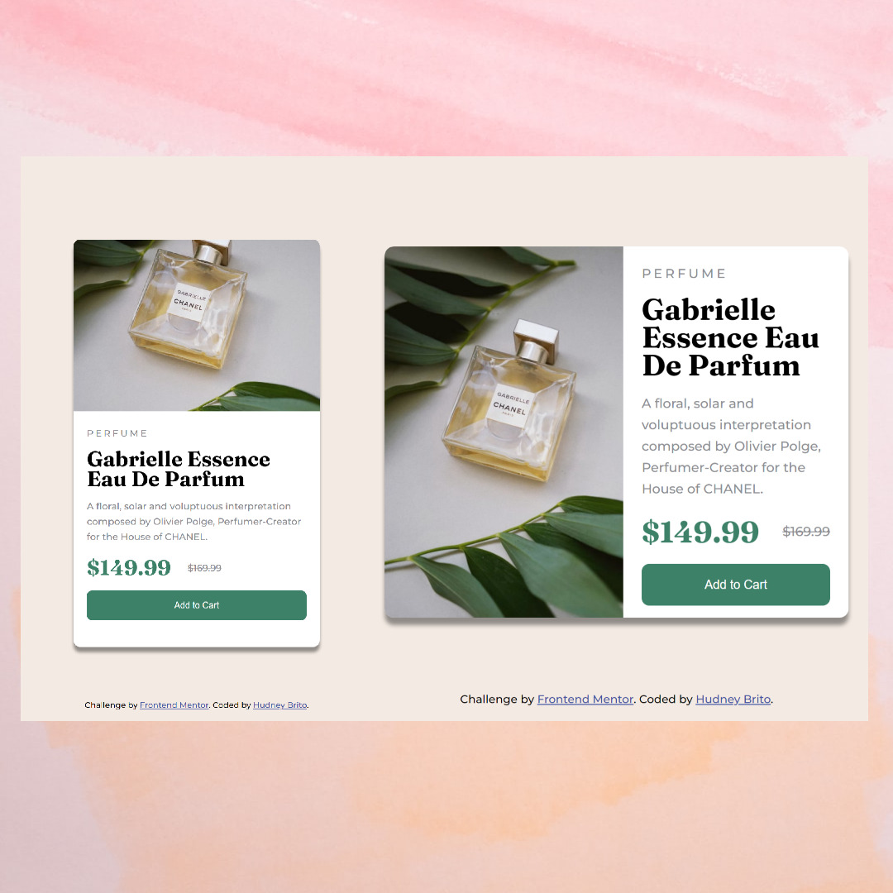
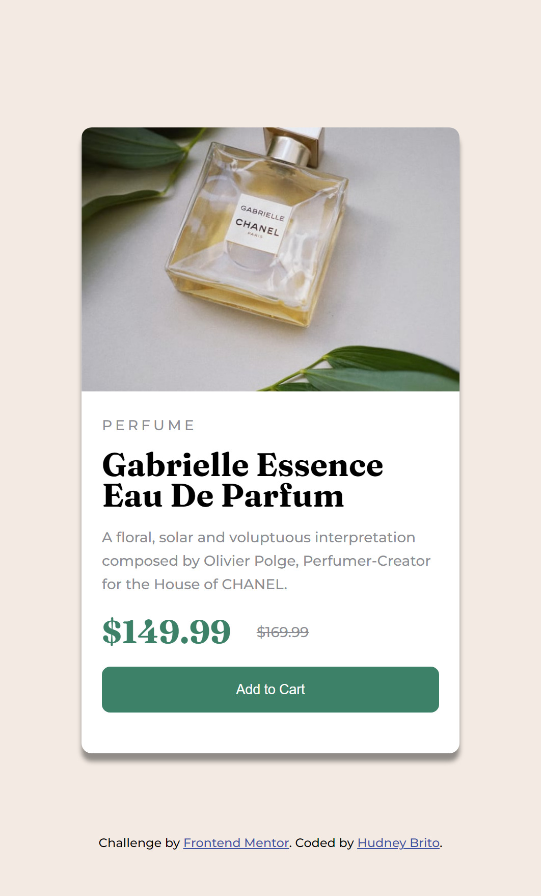

# Frontend Mentor - Solução de componente de cartão de visualização do produto

Esta é uma solução para o [desafio do componente do cartão de visualização do produto no Frontend Mentor](https://www.frontendmentor.io/challenges/product-preview-card-component-GO7UmttRfa). Os desafios do Frontend Mentor ajudam você a melhorar suas habilidades de codificação criando projetos realistas.

## Índice

- [Visão geral](#visão geral)
  - [O desafio](#the-challenge)
  - [Captura de tela](#captura-de-tela)
  - [Links](#links)
- [Meu processo](#meu-processo)
  - [Construído com](#construído-com)
  - [O que aprendi](#o-que-aprendi)
  - [Desenvolvimento contínuo](#desenvolvimento-contínuo)
  - [Recursos úteis](#useful-resources)
- [Autor](#https://hudney-fsbrito.github.io/Hudney-Brito-Portfolio-/)
- [Agradecimentos](#agradecimentos)

## Visão geral

Olá, Bem-vindo! 👋

Este foi um desafio para colocar em prática minhas habilidades que adquirir até aqui. Tentei fazer o mais próximo possível de acordo com o modelo proposto. O projeto é um cartão de visualização de produto que pode ser visto tanto em desktop quanto em mobile que a tela se adequa ao tamanho.



### O desafio

Os usuários devem ser capazes de:

- Visualize o layout ideal dependendo do tamanho da tela do dispositivo
- Veja os estados de foco e foco para elementos interativos

### Captura de tela




### Links

- URL do site ao vivo: [Adicione o URL do site ao vivo aqui](https://hudney-fsbrito.github.io/Componente-do-Cart-o-de-Visualiza--o-do-Produto/)

## Meu processo

### Construído com

- Marcação HTML5 semântica
- Propriedades personalizadas de CSS
- Flexbox
- Fluxo de trabalho mobile-first
- Media Query

### O que eu aprendi

Utilizei o media query para deixar responsivo e flexbox nos posicionamentos. tive dificuldade para centralizar na vertical a div principal (container) na tela, não estava conseguindo aumentar a altura do "body" para o "justify content" fazer efeito. E também tive dificuldade na troca da imagem quando muda de mobile para desktop, usei o visibility pra ocultar uma delas (seria uma boa prática?)

``` css
@media (min-width: 600px) {
    .container-texto {
        width: 50%;
    }
    .container {
        display: flex;
        height: 400px;
        width: 500px;
    }
    .produto-imagem {
        visibility: hidden;
    }
    .container-imagem {
        background: url(images/image-product-desktop.jpg);
        background-size: cover;
        background-position: center;
        box-sizing: border-box;
        border-radius: 10px 0px 0 10px;
    }
}
```

### Desenvolvimento contínuo

Gostaria de aperfecioar, com boas práticas, os posicionamentos de elementos e manipulação de imagens. Estou me aprofundando sobre a utilização de outras tecnologias como o JS nesse tipo de projeto e posteriormente ReactJS.

### Recursos úteis

- [Recurso de exemplo 1](https://www.freecodecamp.org/portuguese/news/html-ou-body-como-definir-a-largura-e-a-altura-como-o-tamanho-total-da-pagina/) - Isso me ajudou pelo ao resultado de centralizar o elemento no meio da tela.
- [Example resource 2](https://developer.mozilla.org/pt-BR/docs/Web/CSS/Media_Queries/Using_media_queries) - Este é um artigo incrível que me ajudou a colocar a responsividade através do media query em prática. Eu recomendo para quem ainda está aprendendo este conceito.

## Autor

- Site - [Hudney Brito](https://hudney-fsbrito.github.io/Hudney-Brito-Portfolio-/)
- Mentor de frontend - [@seunomedeusuário](https://www.frontendmentor.io/profile/seunomedeusuário)

## Agradecimentos

Agradeço aos instrutores dos cursos que estou fazendo para me aprimorar e melhorar minhasn habilidades.